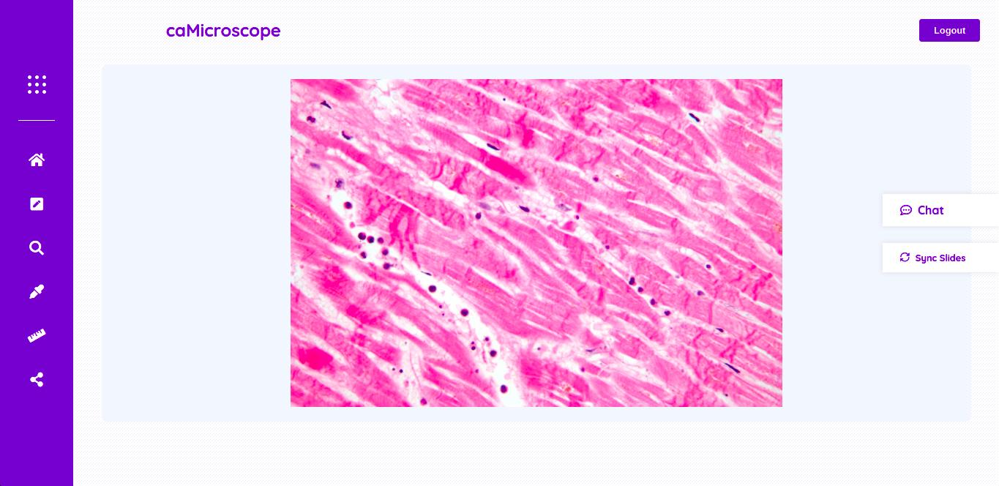
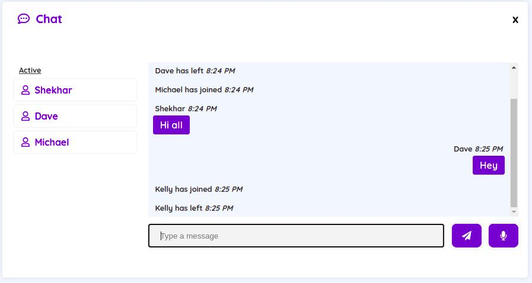

# Realtime Collaborative Pathology



Realtime Collaborative Pathology is an attempt to facilitate communication between pathologists engaged
in digital annotation.

### Features
* Support for deep-zoom tiled images with openSeaDragon viewer
* Room support for collaborations
* Synchronized viewport actions across members in the room
* Realtime text chat
* Realtime audio stream/chat



### Setup

Clone the repository to your local machine and in the directory run

```
npm install
```

### Local hosting

`node index.js`

The application can be accessed on localhost:3000
_3000_ is the default port number